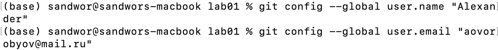
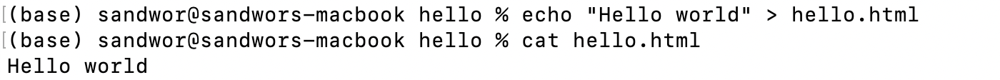
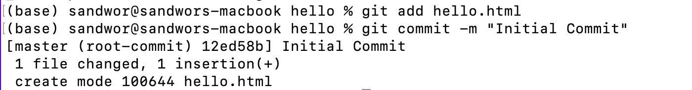
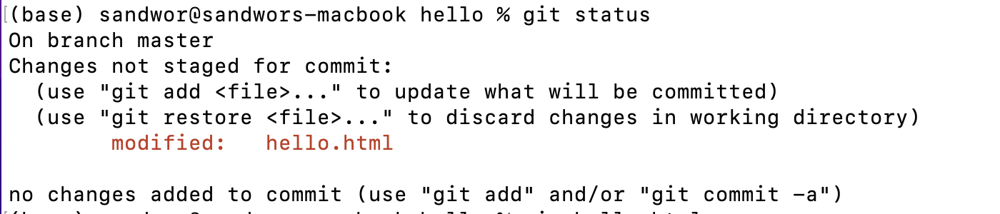
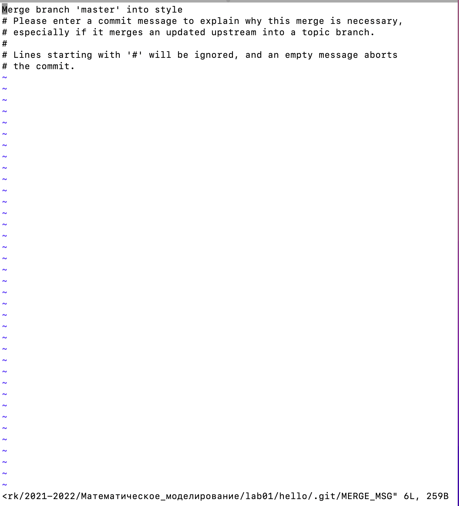
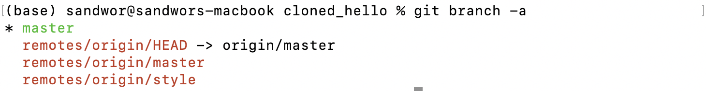
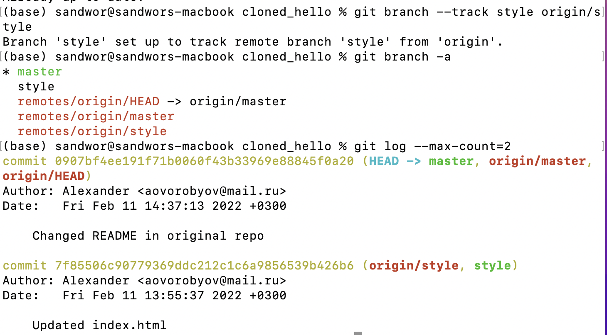

---
# Front matter
title: "Отчет по лабораторной работе"  
subtitle: "Работа с git"  
author: "Воробьев Александр Олегович"  
group: "NFIbd-01-19"

# Generic otions
lang: ru-RU
toc-title: "Содержание"

# Bibliography
bibliography: bib/cite.bib
csl: pandoc/csl/gost-r-7-0-5-2008-numeric.csl

# Pdf output format
toc: true # Table of contents
toc_depth: 2
lof: true # List of figures
lot: true # List of tables
fontsize: 12pt
linestretch: 1.5
papersize: a4
documentclass: scrreprt
## I18n
polyglossia-lang:
  name: russian
  options:
	- spelling=modern
	- babelshorthands=true
polyglossia-otherlangs:
  name: english
### Fonts
mainfont: PT Serif
romanfont: PT Serif
sansfont: PT Sans
monofont: PT Mono
mainfontoptions: Ligatures=TeX
romanfontoptions: Ligatures=TeX
sansfontoptions: Ligatures=TeX,Scale=MatchLowercase
monofontoptions: Scale=MatchLowercase,Scale=0.9
## Biblatex
biblatex: true
biblio-style: "gost-numeric"
biblatexoptions:
  - parentracker=true
  - backend=biber
  - hyperref=auto
  - language=auto
  - autolang=other*
  - citestyle=gost-numeric
## Misc options
indent: true
header-includes:
  - \linepenalty=10 # the penalty added to the badness of each line within a paragraph (no associated penalty node) Increasing the value makes tex try to have fewer lines in the paragraph.
  - \interlinepenalty=0 # value of the penalty (node) added after each line of a paragraph.
  - \hyphenpenalty=50 # the penalty for line breaking at an automatically inserted hyphen
  - \exhyphenpenalty=50 # the penalty for line breaking at an explicit hyphen
  - \binoppenalty=700 # the penalty for breaking a line at a binary operator
  - \relpenalty=500 # the penalty for breaking a line at a relation
  - \clubpenalty=150 # extra penalty for breaking after first line of a paragraph
  - \widowpenalty=150 # extra penalty for breaking before last line of a paragraph
  - \displaywidowpenalty=50 # extra penalty for breaking before last line before a display math
  - \brokenpenalty=100 # extra penalty for page breaking after a hyphenated line
  - \predisplaypenalty=10000 # penalty for breaking before a display
  - \postdisplaypenalty=0 # penalty for breaking after a display
  - \floatingpenalty = 20000 # penalty for splitting an insertion (can only be split footnote in standard LaTeX)
  - \raggedbottom # or \flushbottom
  - \usepackage{float} # keep figures where there are in the text
  - \floatplacement{figure}{H} # keep figures where there are in the text
---

# Цель работы

Изучить принципы работы с git.

# Задание

Включает в себя выполнение следующих пунктов:  
- Подготовка рабочей среды 
- Создание проекта
- Внесение изменений в файл
- Индексация изменений
- Отмена локальных изменений (до индексации)
- Отмена проиндексированных изменений (перед коммитом)
- Отмена коммитов
- Удаление коммиттов из ветки
- Удаление тега oops
- Внесение изменений в коммиты
- Перемещение файлов
- Второй способ перемещения файлов
- Подробное рассмотрение структуры
- Git внутри: Каталог .git
- Работа непосредственно с объектами git
- Создание ветки
- Навигация по веткам
- Изменения в ветке master
- Коммит изменений файла в другую ветку
- Слияние веток
- Создание конфликта
- Разрешение конфликтов
- Сброс ветки
- Сброс ветки master
- Перебазирование
- Слияние в ветку master
- Клонирование репозиториев
- Просмотр клонированного репозитория
- Что такое origin?
- Удаленные ветки
- Изменение оригинального репозитория
- Слияние извлеченных изменений
- Добавление ветки наблюдения
- Чистые репозитории
- Создание чистого репозитория
- Добавление удаленного репозитория
- Отправка изменений
- Извлечение общих изменений

# Теоретическое введение

Git - распределённая система управления версиями. 

| Имя каталога | Описание каталога                                                                                                          |
|--------------|----------------------------------------------------------------------------------------------------------------------------|
| `/`          | Корневая директория, содержащая всю файловую                                                                               |
| `/bin `      | Основные системные утилиты, необходимые как в однопользовательском режиме, так и при обычной работе всем пользователям     |
| `/etc`       | Общесистемные конфигурационные файлы и файлы конфигурации установленных программ                                           |
| `/home`      | Содержит домашние директории пользователей, которые, в свою очередь, содержат персональные настройки и данные пользователя |
| `/media`     | Точки монтирования для сменных носителей                                                                                   |
| `/root`      | Домашняя директория пользователя  `root`                                                                                   |
| `/tmp`       | Временные файлы                                                                                                            |
| `/usr`       | Вторичная иерархия для данных пользователя                                                                                 |

# Выполнение лабораторной работы

1.1.1 Установка имени и электронной почты  

1.1.2 Параметры установки окончаний строк  

1.1.3 Установка отображения unicode  

1.2.1 Создайте страницу «Hello, World»  

1.2.2 Создание репозитория  

1.2.3 Добавление файла в репозиторий    

1.2.4 Проверка состояния репозитория  
Команда git status  

1.3.1 Измените страницу «Hello, World»  
  
  
Проверили статус рабочего каталога  

1.4 Индексация изменений  
  

1.4.1 Коммит изменений  

1.4.2 Добавьте стандартные теги страницы  
  
  
  
  
  

1.4.3 История  

1.4.4 Получение старых версий  

1.4.5 Создание тегов версий  

1.4.6 Переключение по имени тега  

1.4.7 Просмотр тегов с помощью команды tag  

1.5.1 Переключитесь на ветку master  

1.5.2 Измените hello.html  

1.5.3 Проверьте состояние  

1.5.4 Отмена изменений в рабочем каталоге  

1.6.1 Измените файл и проиндексируйте изменения  
  

1.6.2 Проверьте состояние  

1.6.3 Выполните сброс буферной зоны  

1.6.4 Переключитесь на версию коммита  

1.7.2 Измените файл и сделайте коммит  
  

1.7.3 Сделайте коммит с новыми изменениями, отменяющими предыдущие  
  

1.7.4 Проверьте лог  

1.8.3 Для начала отметьте эту ветку  

1.8.4 Сброс коммитов к предшествующим коммиту Oops  

1.8.5 Ничего никогда не теряется  

1.9.1 Удаление тега oops  

1.10.1 Измените страницу, а затем сделайте коммит  
  

1.10.2 Необходим email  

1.10.3 Измените предыдущий коммит  

1.10.4 Просмотр истории  

1.11.1 Переместите файл hello.html в каталог lib  
1.12.1 Коммит в новый каталог  

1.13.1 Добавление index.html  
  

1.14.1 Каталог.git  

1.14.2 База данных объектов  

1.14.3 Углубляемся в базу данных объектов  

1.14.4 Config File  
  

1.14.6 Файл HEAD  

1.15.1 Поиск последнего коммита  

1.15.2 Вывод последнего коммита с помощью SHA1 хэша  

1.15.3 Поиск дерева, 1.15.4 Вывод каталога lib, 1.15.5 Вывод файла hello.html  

1.16.1 Создайте ветку  

1.16.2 Добавьте файл стилей style.css  
  

1.16.3 Измените основную страницу  
  

1.16.4 Измените index.html  
  

1.17 Навигация по веткам  

1.17.1 Переключение на ветку master  

1.17.2 Вернемся к ветке style  

1.18.1 Создайте файл README в ветке master  

1.19 Сделайте коммит изменений README.md в ветку master  

1.19.2 Просмотрите текущие ветки  

1.20.1 Слияние веток  
  
  

1.21.1 Вернитесь в master и создайте конфликт  
  

1.21.2 Просмотр веток  

1.22.1 Слияние master с веткой style  
  
  

1.22.2 Решение конфликта  

1.22.3 Сделайте коммит решения конфликта  

1.23.1 Сброс ветки style  
  

1.23.2 Проверьте ветку  

1.24.1 Сброс ветки master  
  

1.25 Перебазирование  

1.26.1 Слияние style в master  

1.26.2 Просмотрите логи  

1.27.1 Перейдите в рабочий каталог  

1.27.2 Создайте клон репозитория hello  

1.28.1 Давайте взглянем на клонированный репозиторий  

1.28.2 Просмотрите историю репозитория  

1.29 Что такое origin?  

1.30 Удаленные ветки  

1.30.1 Список удаленных веток  

1.31.1 Внесите изменения в оригинальный репозиторий hello  
  

1.31.2 Извлечение изменений  
  

1.31.3 Проверьте README.md  

1.32.1 Слейте извлеченные изменения в локальную ветку master  

1.32.2 Еще раз проверьте файл README.md  

1.33.1 Добавьте локальную ветку, которая отслеживает удаленную ветку  

1.35 Создайте чистый репозиторий  

1.36 Добавление удаленного репозитория  

1.37 Отправка изменений  
  

1.38 Извлечение общих изменений  

# Выводы

В результате выполнения работы я научился работать с консольной утилитой git. Понял как вести и отслеживать историю изменения файлов в проекте. 

# Список литературы{.unnumbered}

Кулябов Д.С. Работа с git. - 31 c.  